# Architecture

Single Python process driven by `uvicorn`, started by `docker compose up`.
Four async background tasks plus the FastAPI app share one event loop, one
Postgres connection pool, and one compiled LangGraph instance. Each task
runs under `supersee.supervisor.run_with_restart` so an unhandled
exception in one cannot wedge the others.

```mermaid
flowchart LR
  %% External
  subgraph EXT["External"]
    XRPL([XRPL public WebSocket<br/>wss://xrplcluster.com/])
    OSAPI([OpenSanctions API])
    ANTH([Anthropic API<br/>claude-haiku-4-5])
    BROWSER([Browser<br/>analyst UI])
  end

  %% Background Tasks
  subgraph BG["Background Tasks (each under run_with_restart)"]
    ING["ingestor<br/>supersee/ingestor.py"]
    Q_EVENTS{{"asyncio.Queue<br/>event_id"}}
    SCORE["scorer loop<br/>run_scorer_loop"]
    Q_CASES{{"asyncio.Queue<br/>case_id"}}
    GRAPHLOOP["graph loop<br/>run_graph_loop<br/>Semaphore(4)"]
    SCHED["scheduler<br/>hourly tick"]
    RECOVERY["lifespan startup<br/>recovery_sweep"]
  end

  %% FastAPI
  subgraph API["FastAPI"]
    APP["supersee/api<br/>FastAPI app"]
    GETCASES["GET /cases"]
    GETCASE["GET /cases/{id}"]
    DECISION["POST /cases/{id}/decision"]
  end

  %% LangGraph (6 nodes)
  subgraph LG["LangGraph (6 nodes)"]
    LSTART((START))
    FETCH["fetch_context"]
    ENRICH["enrich_external"]
    NARR["build_narrative"]
    TRIAGE{"triage_branch"}
    HITL["hitl_pause<br/>interrupt()"]
    OUTCOME["record_outcome"]
    LEND((END))
  end

  %% PostgreSQL
  subgraph PG["PostgreSQL 16 (shared pool)"]
    EVENTS[(events)]
    HISTORY[(account_history)]
    CASES[(cases)]
    ARTIFACTS[(case_artifacts)]
    OFAC[(ofac_sdn_crypto)]
    WATCH[(watchlist)]
    MIXERS[(mixer_addresses)]
    CKPT[(checkpoints<br/>checkpoint_writes<br/>checkpoint_blobs)]
  end

  %% --- live pipeline ---
  XRPL -->|"validated Payments<br/>filter to XRP-only"| ING
  ING -->|"insert normalized<br/>ON CONFLICT DO NOTHING"| EVENTS
  ING --> Q_EVENTS
  Q_EVENTS --> SCORE

  SCORE -->|"build_context"| HISTORY
  SCORE -->|"write case row<br/>(low → auto_closed)"| CASES
  SCORE -->|"medium/high only"| Q_CASES
  Q_CASES --> GRAPHLOOP
  GRAPHLOOP -->|"ainvoke(thread_id=case_id)"| LSTART

  %% --- scheduler + crash recovery ---
  SCHED -->|"daily fetch (tenacity retry)"| OSAPI
  SCHED -->|"upsert SDN crypto"| OFAC
  SCHED -->|"delete >90 days"| ARTIFACTS

  EVENTS --> RECOVERY
  CASES --> RECOVERY
  RECOVERY -->|"events with no case"| Q_EVENTS
  RECOVERY -->|"pending / in_progress<br/>(NOT pending_hitl)"| Q_CASES

  %% --- analyst UI ---
  BROWSER --> APP
  APP --> GETCASES
  APP --> GETCASE
  APP --> DECISION
  GETCASES --> CASES
  GETCASE --> CASES
  GETCASE --> ARTIFACTS
  GETCASE --> CKPT
  DECISION -->|"Command(resume=...)<br/>stale-resume guarded"| HITL

  %% --- LangGraph node edges ---
  LSTART --> FETCH
  FETCH --> ENRICH
  ENRICH --> NARR
  NARR --> TRIAGE
  TRIAGE -->|"auto_close path"| OUTCOME
  TRIAGE -->|"needs analyst<br/>or low confidence"| HITL
  HITL --> OUTCOME
  OUTCOME --> LEND

  %% --- node ↔ DB reads ---
  FETCH --> HISTORY
  ENRICH --> EVENTS
  ENRICH --> OFAC
  ENRICH --> WATCH
  ENRICH --> MIXERS
  NARR -->|"LLM<br/>graceful fallback on 401/timeout"| ANTH
  HITL -->|"suspend state"| CKPT
  OUTCOME -->|"final status + audit"| CASES
  OUTCOME --> ARTIFACTS
```

## How to read it

The pipeline runs left to right. An XRPL Payment becomes a normalized
event, becomes a case row, becomes a LangGraph thread, becomes (usually) a
suspended state waiting on an analyst. The analyst's decision in the
browser resumes the suspended thread, which writes the final status and
audit artifact and ends.

Three patterns from the eng review are visible in the diagram.

**Bounded concurrency.** Every node-to-LLM edge funnels through the
`Semaphore(4)` on `graph loop`. A startup burst of 100 cases from the
recovery sweep cannot stampede the Anthropic API; at most four
investigations are in flight at any moment.

**Crash recovery, not crash prevention.** The two back-edges from
`events` and `cases` into the `recovery_sweep` block represent what runs
once at lifespan startup, before any consumer task begins. Orphaned
events and `pending` / `in_progress` cases get re-enqueued. The deliberate
omission is `pending_hitl` cases: those are correctly suspended in the
checkpointer waiting on an analyst, and re-driving them from `START`
would corrupt the audit trail.

**HITL as a real out-of-band resume.** The edge from `POST
/cases/{id}/decision` into `hitl_pause` is the load-bearing demonstration
of agentic-but-controllable behavior. The graph thread is genuinely
suspended at `interrupt()`. The browser-driven decision arrives possibly
seconds, minutes, or days later, and `Command(resume=...)` continues from
exactly where the graph stopped. A `stale-resume guard` on the endpoint
checks `cases.status` before invoking; a double-clicked Approve or a
stale browser tab gets a flash message, not a corrupted case.

## Tables, briefly

| Table | What it holds | Who writes |
| --- | --- | --- |
| `events` | One row per validated XRP Payment, deduped on `tx_hash` | `ingestor` |
| `account_history` | Rolling P99, total seen, known counterparties per account | `scorer` (via `history.record_event`) |
| `cases` | Investigation header: status, band, rule_hits | `scorer`, `record_outcome`, `hitl_pause` |
| `case_artifacts` | Append-only audit: enrichment, narrative, analyst decision | LangGraph nodes (via `record_outcome`) |
| `ofac_sdn_crypto` | SDN crypto addresses (cross-chain) | `scheduler` (via `enrichment.ofac.refresh_ofac`) |
| `watchlist`, `mixer_addresses` | Curated address lists | Hand-managed / seed files |
| `checkpoints*` (×3) | LangGraph checkpointer state per thread | `AsyncPostgresSaver` (LangGraph internal) |

For the full DDL with triggers, indices, and constraint definitions, see
[`migrations/001_initial.sql`](migrations/001_initial.sql).

## File pointers

For the parts the diagram glosses over, the source modules are the
authoritative spec:

- [`supersee/ingestor.py`](supersee/ingestor.py) — XRPL subscription,
  Payment filter, `tx_hash` dedupe, backpressure handling on the
  scorer queue, cursor save every 50 events.
- [`supersee/pipeline.py`](supersee/pipeline.py) — `run_scorer_loop`,
  `run_graph_loop` with the semaphore, and `recovery_sweep`.
- [`supersee/supervisor.py`](supersee/supervisor.py) — `run_with_restart`
  with exponential backoff and clean `CancelledError` propagation.
- [`supersee/graph/state.py`](supersee/graph/state.py) — the
  `InvestigationState` TypedDict and `AuditLogEntry` shape.
- [`supersee/graph/triage.py`](supersee/graph/triage.py) — the
  deterministic truth table that maps `(band, recommended_action,
  confidence)` to a `(triage_path, case_status)` pair.
- [`supersee/graph/nodes.py`](supersee/graph/nodes.py) — the six node
  implementations, including the `hitl_pause` interrupt and
  `record_outcome` tenacity-retried writes.
- [`supersee/api/routes.py`](supersee/api/routes.py) — the three
  HTTP handlers; the stale-resume guard is in `case_decision`.

## The crash-recovery contract, explicitly

| Case status at the time of crash | What recovery_sweep does | Why |
| --- | --- | --- |
| event row, no case row | Re-enqueues to `event_queue` | Scorer dropped it; re-score |
| `pending` | Re-enqueues to `graph_queue` | Scorer wrote case but graph never started |
| `in_progress` | Re-enqueues to `graph_queue` | Graph crashed mid-flight; LangGraph's checkpointer picks up from the last successful node |
| `pending_hitl` | **Does nothing** | Graph is correctly suspended in the checkpointer waiting on an analyst. Re-driving from START would corrupt the audit_log. The analyst still resumes via `POST /cases/{id}/decision`. |
| `escalated` | **Does nothing** | Same as `pending_hitl`; the status flag is just for UI emphasis. |
| `approved`, `rejected`, `auto_closed`, `errored` | **Does nothing** | Terminal state. |

This table is the contract `recovery_sweep` honors. See
[`supersee/pipeline.py:recovery_sweep`](supersee/pipeline.py) and the
test that codifies it at
[`supersee/tests/test_pipeline.py:TestRecoverySweep`](supersee/tests/test_pipeline.py).
